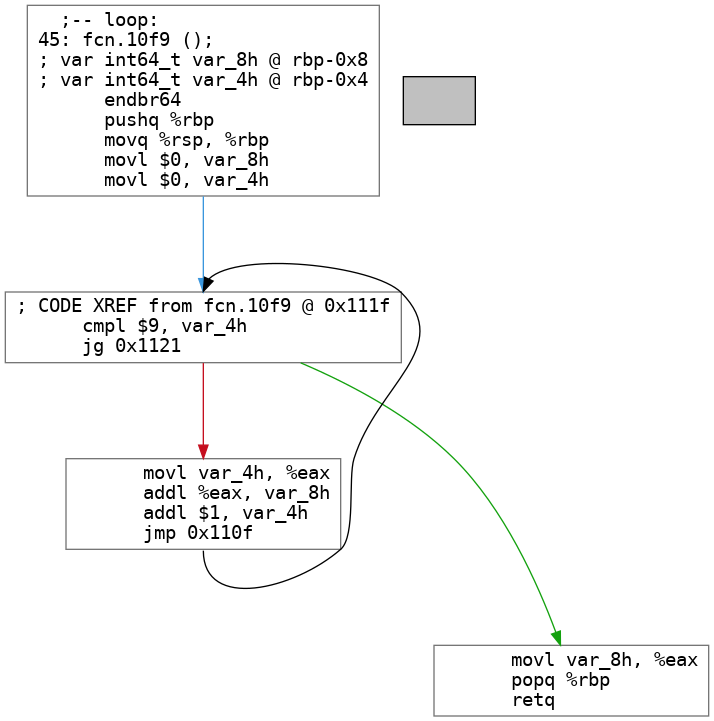

# CFiddle: A Tool For Studying Small Compiled rograms

[](https://circleci.com/gh/circleci/circleci-docs)
[](https://mybinder.org/v2/gh/NVSL/cfiddle/main?labpath=README.ipynb)
[](https://cfiddle-docs.readthedocs.io/en/latest/?badge=latest)
	
CFiddle is a tool for studying the compilation and execution of smallish programs written in C or
C++.  If you want to know what the compiler does to your code and why your code is slow, CFiddle can help.

It makes it easy to ask and answer interesting questions about what happens to
programs as they go from source code to running program.  CFiddle can run on its
own, but it is built to work with [Jupyter Notebook/Jupyter
Lab](https://jupyter.org/) to support interactive exploration.

It's features include:

1. Support for compiled languages like C and C++.
2. [Control Flow Graph (CFG)](https://en.wikipedia.org/wiki/Control-flow_graph) generation from compiled code.
3. Easy support for varying build-time and run-time paremeters.
4. Easy, unified parameter and data gathering across building and running code.
5. Works great with [Pandas](https://pandas.pydata.org/) and  [Jupyter Notebook/Lab](https://jupyter.org/).

The best way to learn about CFiddle is to try it.  You can [run the
examples](https://mybinder.org/v2/gh/NVSL/cfiddle/main?labpath=README.ipynb) (this can take a while to load).

Or run it locally with Docker:

```
docker run -it --publish published=8888,target=8888 stevenjswanson/cfiddle:latest jupyter lab --LabApp.token=''
```

and then visit http://localhost:8888/lab/tree/README.ipynb.

You can also read [the documentation](https://cfiddle-docs.readthedocs.io).

## Examples

### What Does a `for` loop look like in assembly?

```python
>>> from cfiddle import * 
>>> sample = code(r""" 
...    extern "C"
...    int loop() {
...    int sum = 0;
...	   for(int i = 0; i < 10; i++) {
... 		sum += i;
...    }
...	   return sum;
... }
... """)
>>> asm = build(sample)[0].asm("loop")
>>> print(asm) # doctest: +SKIP
loop:
.LFB0:
    .cfi_startproc
    endbr64
    pushq    %rbp
    .cfi_def_cfa_offset 16
    .cfi_offset 6, -16
    movq    %rsp, %rbp
    .cfi_def_cfa_register 6
    movl    $0, -8(%rbp)
    movl    $0, -4(%rbp)
.L3:
    cmpl    $9, -4(%rbp)
    jg    .L2
    movl    -4(%rbp), %eax
    addl    %eax, -8(%rbp)
    addl    $1, -4(%rbp)
    jmp    .L3
.L2:
    movl    -8(%rbp), %eax
    popq    %rbp
    .cfi_def_cfa 7, 8
    ret
    .cfi_endproc

```

Or, if you prefer a CFG:

```
>>> build(sample)[0].cfg("loop", "readme_loop.png") 
'readme_loop.png'

```



### What Does `-O3` Do To That Loop?

```python
>>> asm = build(sample, build_parameters=dict(OPTIMIZE="-O3"))[0].asm("loop")
>>> print(asm) # doctest: +SKIP
loop:
.LFB0:
    .cfi_startproc
	endbr64
	movl	$45, %eax
	ret
	.cfi_endproc
	
```


## Local Installation

CFiddle depends on some system packages and python's `wheel`.  Setup a virtual environment:

```
python -m venv cfiddle-venv
```

Become root, so you can install the systetm packages with `apt-get` with 

```
sudo bash
. cfiddle-venv/bin/activate	
make install-prereqs
exit
```

Install cfiddle:

```
. cfiddle-venv/bin/activate
pip install .
```

Run the tests:

```
make test
```

## Common Problems

CFiddle needs `LD_LIBRARY_PATH` set properly to work, and it can't set it itself reliably.  If you get

```
OSError: libcfiddle.so: cannot open shared object file: No such file or directory
```

You can update `LD_LIBRARY_PATH` with:

```
$(set-cfiddle-ld-path)
```


## Saving Your Work

If you want to save changes you make to any of the examples, you'll need to run docker something like this:

```
docker run -it --publish published=8888,target=8888 --mount type=bind,source=$HOME,dst=/home/jovyan -w /home/jovyan/cfiddle_work/cfiddle  stevenjswanson/cfiddle:latest  jupyter lab --LabApp.token=''
```
